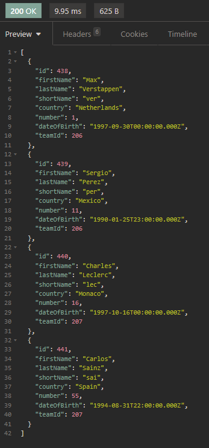
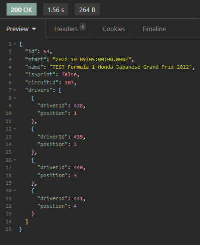
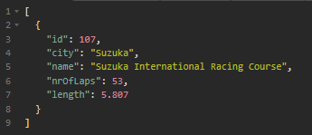
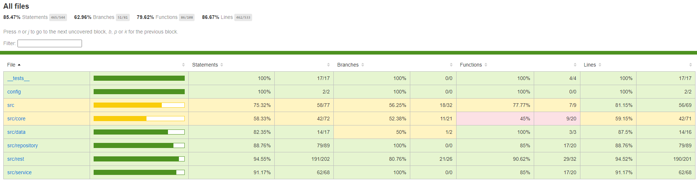

# Voornaam Familienaam (Studentennummer)

- [ ] Front-end Web Development
  - [GitHub repository](github.com/HOGENT-Web)
  - [Online versie](github.com/HOGENT-Web)
- [x] Web Services: GITHUB URL
  - [GitHub repository](https://github.com/Web-IV/2223-webservices-JulesRosier)
  - [Online versie](https://two223-webservices-julesrosier.onrender.com)

**Logingegevens**

- Gebruikersnaam/e-mailadres: jules.rosier@student.hogent.be
- Wachtwoord: Woorden123

## Projectbeschrijving

Mijn project houd F1 raceresulaten en informatie over de driver, teams, circuits.

## Screenshots

## Behaalde minimumvereisten

### Web Services

- **datalaag**

  - [x] voldoende complex (meer dan één tabel)
  - [x] één module beheert de connectie + connectie wordt gesloten bij sluiten server
  - [x] heeft migraties
  - [x] heeft seeds
         

- **repositorylaag**

  - [x] definieert één repository per entiteit (niet voor tussentabellen) - indien van toepassing
  - [x] mapt OO-rijke data naar relationele tabellen en vice versa
         

- **servicelaag met een zekere complexiteit**

  - [x] bevat alle domeinlogica
  - [x] bevat geen SQL-queries of databank-gerelateerde code
         

- **REST-laag**

  - [x] meerdere routes met invoervalidatie
  - [x] degelijke foutboodschappen
  - [x] volgt de conventies van een RESTful API
  - [x] bevat geen domeinlogica
  - [x] degelijke authorisatie/authenticatie op alle routes
         

- **varia**
  - [x] een aantal niet-triviale testen (min. 1 controller >=80% coverage)
  - [x] minstens één extra technologie
  - [x] duidelijke en volledige `README.md`
  - [x] maakt gebruik van de laatste ES6-features (object destructuring, spread operator...)
  - [x] volledig en tijdig ingediend dossier

## Projectstructuur

### Web Services

De mappen heb ik mij vrij dicht aan de aangeleerde structuur gehouden uit de les. Een `src` map waar effectieve code in zit. Hier in word alles onderverdeelt volgens hun lagen zoals repository en rest. 

Op het vlak van de code zelf heb ik mij zoveel mogelijk gehouden aan het schrijven van pure functies. De code is dus ook zo goed als volledig functioneel.

## Extra technologie

### Web Services

Ik heb gekozen voor een ORM (Object-relational mapping) gekozen voor dit project. Namelijk [Prisma](https://www.npmjs.com/package/prisma), dit lijkt mij een moderne en makelijk te gebuiken library die alles functies bevat die ik nodig had.

## Testresultaten

### Web Services

Alles onderdelen van de rest lagen worden voornamelijk getest, inclusief health. Veel voorkomende errors worden ook getest zoals 404, 401 en 400. Alle testen maken ook altijd gebruik van authenticatie.

## Gekende bugs

### Web Services

Er zijn geen bugs waar ik op de hoogte van ben maar ik sleut het niet uit dat er mogelijks bugs zouden zijn.

